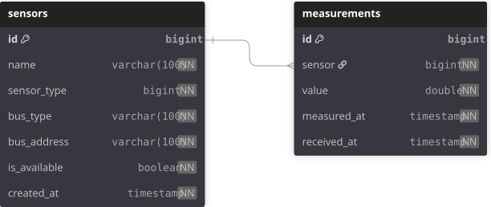

# java-pisense

### Stack
`Java` · `Spring Boot` · `Spring MVC` · `Spring Data JPA` · `Hibernate` · `REST API` · `PostgreSQL` · `SQL` · `Git` · `Maven` · `Docker` · `JUnit` · `Mockito` · `Postman`

## Описание проекта
Микросервис запускается в Docker-контейнере на Raspberry Pi, 
опрашивает подключённые датчики (температура, давление, влажность, 
освещённость) через шины I2C, SPI и 1-Wire, 
нормализует показания в единый JSON и периодически отправляет 
их на pisense-server по HTTP. Имеет домашнюю страницу со статусом 
и списком последних измерений.

## Приложение содержит микросервисы:
- pisense-server — приём JSON, запись в Postgres
- pisense-bridge — I2C/SPI/1-Wire → JSON → server

Каждый микросервис запускается в собственном Docker контейнере.

## Принципы
- S: каждый класс отвечает только за одну шину/один датчик.
- O: новые датчики добавляются реализацией интерфейса SensorReader без правки существующего кода.
- L: любая реализация SensorReader взаимозаменяема.
- I: узкий интерфейс SensorReader (только read() и getType()).
- D: SensorService зависит от абстракции SensorReader, а не от конкретных драйверов.
- Идемпотентность — повторная отправка того же пакета не создаёт дубликатов.

# ER-диаграмма базы данных
<p align="center">
  
</p>
База данных нормализована к третьей нормальной форме (3NF), 
что обеспечивает минимизацию избыточности данных и улучшает целостность данных.

# Эндпоинты микросервисов piSense
## pisense-bridge

| Метод | Путь | Ответ | Описание |
|---|---|---|---|
| GET | `/` | `text/html` | Домашняя страница со статусом датчиков |
| GET | `/api/v1/sensors` | `List<SensorDto>` | Список зарегистрированных датчиков |
| GET | `/api/v1/measurements/last` | `List<MeasurementDto>` | Последние измерения |
| POST | `/api/v1/measurements/read` | `BatchDto` | Принудительный опрос всех датчиков |
| GET | `/actuator/health` | `HealthDto` | Проверка здоровья сервиса |

---

## pisense-server

| Метод | Путь | Ответ | Описание |
|---|---|---|---|
| GET | `/` | `text/html` | Домашняя страница со статистикой |
| POST | `/api/v1/measurements` | `201 Created` / `200 OK` | Приём батча от bridge, идемпотентная запись в Postgres |
| GET | `/api/v1/measurements` | `Page<MeasurementDto>` | История измерений с фильтрами и пагинацией |
| GET | `/api/v1/measurements/latest` | `List<MeasurementDto>` | Последнее измерение по каждому датчику |
| GET | `/actuator/health` | `HealthDto` | Проверка здоровья сервиса и БД |

# Команды Docker
## Разработка на x86 (всё в Docker):
```
cp .env.example .env
docker compose up --build
```
Откройте http://localhost:8080 (bridge) и http://localhost:9090 (server). Данные Postgres лягут в /data/postgres.

## Развёртывание на Pi (вариант 1, проще)
```
клонируйте репозиторий на Pi, в .env укажите COMPOSE_FILE=docker-compose.yml:docker-compose.pi.yml и PISENSE_DATA_DIR, 
затем docker compose up -d --build. Сборка Maven на A53 займёт несколько минут.
```
## Развёртывание на Pi (вариант 2, образ собирается на машине разработчика):
```
docker run --privileged --rm tonistiigi/binfmt --install arm64   # один раз
docker buildx build --platform linux/arm64 -f bridge/Dockerfile -t pisense-bridge --load .
docker save pisense-bridge | ssh pi@raspberrypi docker load
```